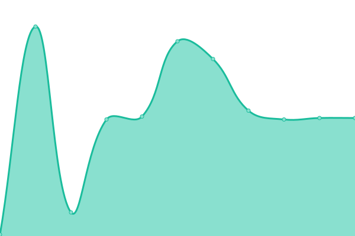
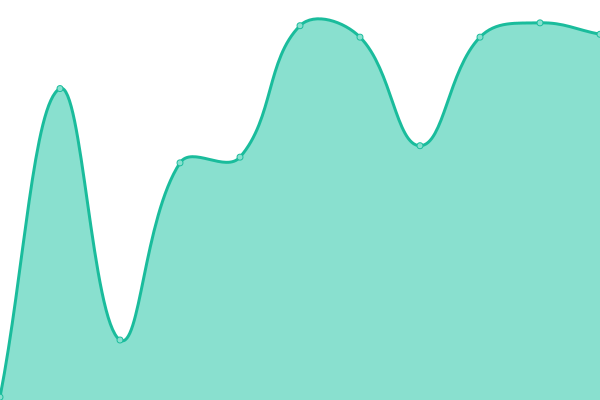
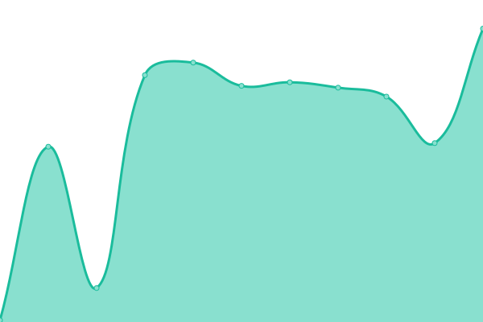

# [📈 Live Status](https://demo.upptime.js.org): <!--live status--> **🟩 All systems operational**

This repository contains the open-source uptime monitor and status page for [Upptime](https://upptime.js.org), powered by [Upptime](https://github.com/upptime/upptime).

<!--start: status pages-->
<!-- This summary is generated by Upptime (https://github.com/upptime/upptime) -->
<!-- Do not edit this manually, your changes will be overwritten -->

| URL                                                                                     | Status | History                                                                                                                               | Response Time                                                                                  | Uptime                                                                                                                                                                                                                                                  |
| --------------------------------------------------------------------------------------- | ------ | ------------------------------------------------------------------------------------------------------------------------------------- | ---------------------------------------------------------------------------------------------- | ------------------------------------------------------------------------------------------------------------------------------------------------------------------------------------------------------------------------------------------------------- |
| [Waypath App](https://app.waypath.io)                                                   | 🟩 Up  | [waypath-app.yml](https://github.com/fullprofile/status_monitor/commits/master/history/waypath-app.yml)                               |  434ms               |                                |
| [Metabase](https://metabase.waypath.io/)                                                | 🟩 Up  | [metabase.yml](https://github.com/fullprofile/status_monitor/commits/master/history/metabase.yml)                                     |  371ms                  |                                      |
| [OUS Service](https://api.waypath.io/ous/health-monitor)                                | 🟩 Up  | [ous-service.yml](https://github.com/fullprofile/status_monitor/commits/master/history/ous-service.yml)                               |  316ms               |                                |
| [Reference Service](https://api.waypath.io/reference/health-monitor)                    | 🟩 Up  | [reference-service.yml](https://github.com/fullprofile/status_monitor/commits/master/history/reference-service.yml)                   |  81ms          |                    |
| [Contracts Service](https://api.waypath.io/contracts/health-monitor)                    | 🟩 Up  | [contracts-service.yml](https://github.com/fullprofile/status_monitor/commits/master/history/contracts-service.yml)                   |  62ms          |                    |
| [CSV Export Service](https://api.waypath.io/csv/health-monitor)                         | 🟩 Up  | [csv-export-service.yml](https://github.com/fullprofile/status_monitor/commits/master/history/csv-export-service.yml)                 |  98ms         |                  |
| [Terminologies Service](https://api.waypath.io/terminologies/health-monitor)            | 🟩 Up  | [terminologies-service.yml](https://github.com/fullprofile/status_monitor/commits/master/history/terminologies-service.yml)           |  64ms      |            |
| [Markets Service](https://api.waypath.io/markets/health-monitor)                        | 🟩 Up  | [markets-service.yml](https://github.com/fullprofile/status_monitor/commits/master/history/markets-service.yml)                       |  101ms           |                        |
| [Deliveries Service](https://api.waypath.io/deliveries/v1/health-monitor)               | 🟩 Up  | [deliveries-service.yml](https://github.com/fullprofile/status_monitor/commits/master/history/deliveries-service.yml)                 |  66ms         |                  |
| [Org Inventory Service](https://api.waypath.io/orginventories/health-monitor)           | 🟩 Up  | [org-inventory-service.yml](https://github.com/fullprofile/status_monitor/commits/master/history/org-inventory-service.yml)           |  84ms      |            |
| [Location Inventory Service](https://api.waypath.io/locationinventories/health-monitor) | 🟩 Up  | [location-inventory-service.yml](https://github.com/fullprofile/status_monitor/commits/master/history/location-inventory-service.yml) |  88ms |  |
| [IOT Service](https://api.waypath.io/iot/health-monitor)                                | 🟩 Up  | [iot-service.yml](https://github.com/fullprofile/status_monitor/commits/master/history/iot-service.yml)                               |  107ms               |                                |
| [Orders Service](https://api.waypath.io/orders/health-monitor)                          | 🟩 Up  | [orders-service.yml](https://github.com/fullprofile/status_monitor/commits/master/history/orders-service.yml)                         |  89ms             |                          |

<!--end: status pages-->

## 📄 License

- Code: [MIT](./LICENSE) © [Upptime](https://upptime.js.org)
- Data in the `./history` directory: [Open Database License](https://opendatacommons.org/licenses/odbl/1-0/)
